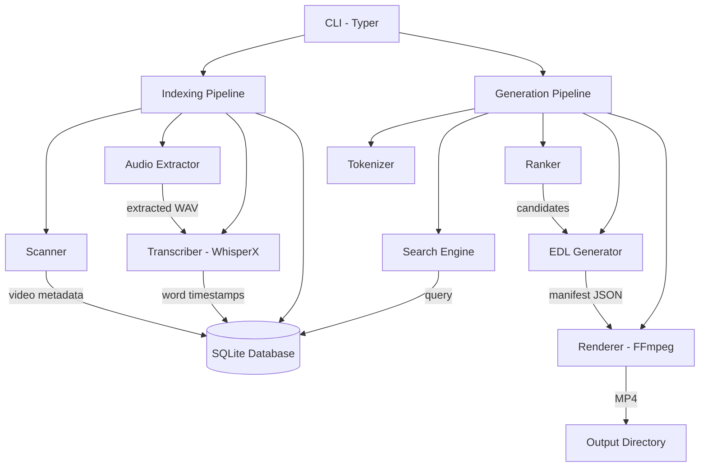
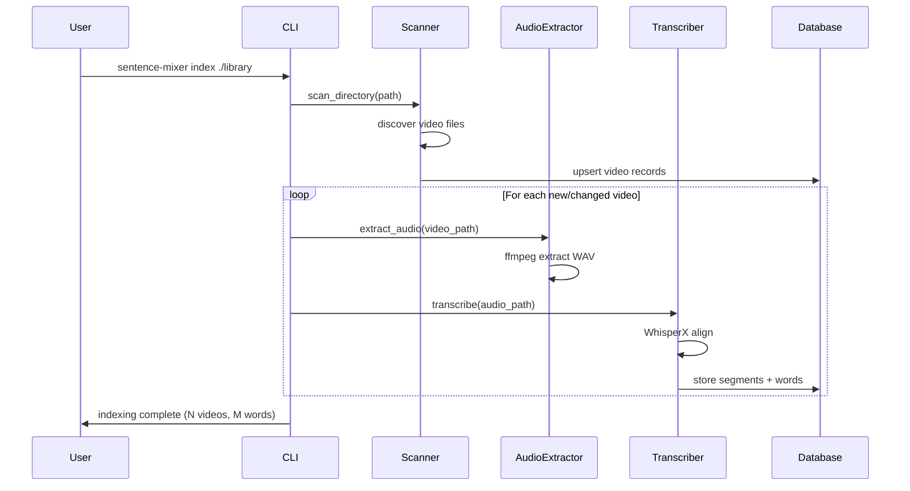
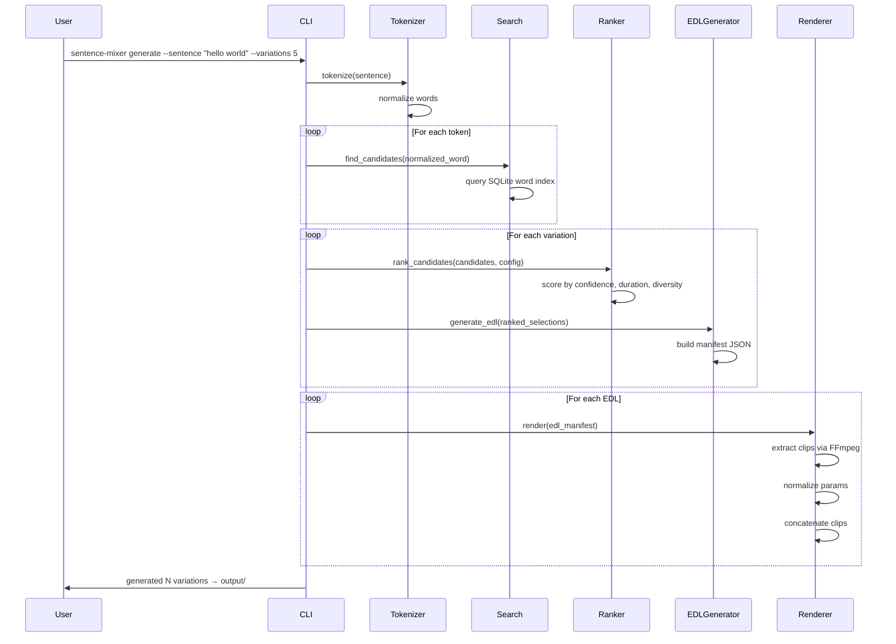

# Design Document: Sentence Mixer

## Overview

Sentence Mixer is a local-first video editing engine that constructs arbitrary sentences by extracting and splicing word-level audio/video clips from a library of indexed videos. The system operates as a deterministic pipeline: videos are ingested and transcribed to produce word-level timestamps, which are stored in SQLite. When a user provides a sentence, the system tokenizes it, searches the word index for matching candidates, ranks them using heuristics (confidence, duration, diversity), generates an EDL manifest, and renders the final MP4 by extracting and concatenating clips via FFmpeg.

The architecture is split into two decoupled phases — indexing (import → transcribe → store) and generation (tokenize → search → rank → render) — enabling a "index once, generate many" workflow. The CLI interface uses Typer with two primary commands: `index` and `generate`.

## Architecture



## Sequence Diagrams

### Indexing Pipeline



### Generation Pipeline



## Components and Interfaces

### Component 1: Scanner

**Purpose**: Discovers video files in a directory and extracts metadata via ffprobe.

```python
from pathlib import Path
from sentence_mixer.models.schemas import VideoMetadata

class Scanner:
    SUPPORTED_EXTENSIONS: set[str] = {".mp4", ".mkv", ".avi", ".mov", ".webm"}
    
    def scan_directory(self, directory: Path) -> list[VideoMetadata]:
        """Recursively scan directory for video files and extract metadata."""
        ...
    
    def probe_video(self, video_path: Path) -> VideoMetadata:
        """Extract metadata from a single video file using ffprobe."""
        ...
```

**Responsibilities**:
- Recursively discover video files by extension
- Extract duration, resolution, fps, audio sample rate via ffprobe
- Skip already-indexed files (based on path + modification time)

### Component 2: Audio Extractor

**Purpose**: Extracts audio tracks from video files as WAV for transcription.

```python
from pathlib import Path

class AudioExtractor:
    def extract_audio(
        self, video_path: Path, output_dir: Path, sample_rate: int = 16000
    ) -> Path:
        """Extract audio from video as mono WAV at specified sample rate."""
        ...
```

**Responsibilities**:
- Convert video audio to mono WAV at 16kHz (WhisperX requirement)
- Cache extracted audio to avoid re-processing
- Report extraction failures clearly

### Component 3: Transcriber

**Purpose**: Produces word-level timestamps from audio using WhisperX.

```python
from pathlib import Path
from sentence_mixer.models.schemas import TranscriptionResult

class Transcriber:
    def __init__(self, model_size: str = "base", device: str = "cpu"):
        ...
    
    def transcribe(self, audio_path: Path) -> TranscriptionResult:
        """Transcribe audio and return word-level aligned timestamps."""
        ...
```

**Responsibilities**:
- Load WhisperX model and alignment model
- Produce segment-level and word-level timestamps
- Return confidence scores per word
- Handle speaker diarization (optional)

### Component 4: Database Layer

**Purpose**: Manages SQLite storage for video metadata, segments, and words.

```python
from pathlib import Path
from sentence_mixer.models.schemas import VideoMetadata, Segment, Word

class Database:
    def __init__(self, db_path: Path):
        ...
    
    def initialize(self) -> None:
        """Create tables and indexes if not exist."""
        ...
    
    def upsert_video(self, metadata: VideoMetadata) -> int:
        """Insert or update video record, return video_id."""
        ...
    
    def store_transcription(
        self, video_id: int, segments: list[Segment], words: list[Word]
    ) -> None:
        """Store segments and words for a video."""
        ...
    
    def find_words(self, normalized_word: str) -> list[Word]:
        """Find all word occurrences matching normalized form."""
        ...
    
    def get_video(self, video_id: int) -> VideoMetadata | None:
        """Retrieve video metadata by ID."""
        ...
```

**Responsibilities**:
- Schema creation and migration
- CRUD operations for videos, segments, words
- Efficient word lookup via index on normalized_word
- Transaction management

### Component 5: Tokenizer

**Purpose**: Normalizes user input sentences into searchable tokens.

```python
class Tokenizer:
    def tokenize(self, sentence: str) -> list[str]:
        """Split sentence into normalized word tokens."""
        ...
    
    def normalize_word(self, word: str) -> str:
        """Normalize: lowercase, strip punctuation, Unicode NFKC."""
        ...
```

**Responsibilities**:
- Split on whitespace
- Lowercase transformation
- Strip punctuation (preserve hyphens within words)
- Unicode NFKC normalization
- Return ordered list of normalized tokens

### Component 6: Search Engine

**Purpose**: Finds candidate word clips from the database.

```python
from sentence_mixer.models.schemas import WordCandidate

class SearchEngine:
    def find_candidates(self, normalized_word: str) -> list[WordCandidate]:
        """Find all candidate clips for a given normalized word."""
        ...
    
    def find_candidates_batch(
        self, tokens: list[str]
    ) -> dict[str, list[WordCandidate]]:
        """Find candidates for multiple tokens efficiently."""
        ...
```

**Responsibilities**:
- Query word index for exact matches
- Return candidate metadata (timestamps, confidence, source video)
- Handle missing words gracefully (report which tokens have no matches)

### Component 7: Ranker

**Purpose**: Scores and selects the best candidate combination for each variation.

```python
from sentence_mixer.models.schemas import WordCandidate, RankingConfig

class Ranker:
    def __init__(self, config: RankingConfig):
        ...
    
    def rank(
        self,
        candidates_per_token: dict[str, list[WordCandidate]],
        num_variations: int,
    ) -> list[list[WordCandidate]]:
        """Produce N ranked variations (each is a list of selected candidates)."""
        ...
    
    def score_candidate(self, candidate: WordCandidate) -> float:
        """Score a single candidate based on heuristics."""
        ...
```

**Responsibilities**:
- Score candidates by: confidence, duration reasonableness, source diversity
- Produce multiple distinct variations
- Prefer same-speaker sequences by default
- Ensure each variation uses different candidate combinations where possible

### Component 8: EDL Generator

**Purpose**: Produces JSON manifest describing clip extraction and concatenation.

```python
from pathlib import Path
from sentence_mixer.models.schemas import WordCandidate, EDLManifest

class EDLGenerator:
    def __init__(self, clip_padding: float = 0.10):
        ...
    
    def generate(
        self, selections: list[WordCandidate], output_name: str
    ) -> EDLManifest:
        """Generate an EDL manifest from selected candidates."""
        ...
```

**Responsibilities**:
- Apply configurable clip padding (before/after each word)
- Clamp padding to not exceed segment boundaries
- Include source attribution per clip
- Serialize to JSON

### Component 9: Renderer

**Purpose**: Extracts clips and concatenates them into final MP4 via FFmpeg.

```python
from pathlib import Path
from sentence_mixer.models.schemas import EDLManifest, RenderConfig

class Renderer:
    def __init__(self, config: RenderConfig):
        ...
    
    def render(self, manifest: EDLManifest, output_path: Path) -> Path:
        """Render EDL manifest into final MP4."""
        ...
    
    def extract_clip(
        self, video_path: Path, start: float, end: float, output_path: Path
    ) -> Path:
        """Extract a single clip with normalized parameters."""
        ...
    
    def concatenate(self, clips: list[Path], output_path: Path) -> Path:
        """Concatenate clips into single MP4 using FFmpeg concat."""
        ...
```

**Responsibilities**:
- Extract individual clips with FFmpeg (trim + normalize)
- Normalize video parameters (resolution, fps, pixel format, sample rate, channels)
- Concatenate using FFmpeg concat demuxer
- Clean up temporary clip files
- Report rendering progress

## Data Models

### Core Schemas (Pydantic)

```python
from pydantic import BaseModel, Field
from pathlib import Path
from datetime import datetime
from enum import Enum


class VideoStatus(str, Enum):
    PENDING = "pending"
    INDEXED = "indexed"
    FAILED = "failed"


class VideoMetadata(BaseModel):
    id: int | None = None
    path: Path
    filename: str
    duration: float
    width: int
    height: int
    fps: float
    audio_sample_rate: int
    created_at: datetime = Field(default_factory=datetime.now)
    status: VideoStatus = VideoStatus.PENDING


class Segment(BaseModel):
    id: int | None = None
    video_id: int
    start_time: float
    end_time: float
    text: str
    speaker: str | None = None
    confidence: float


class Word(BaseModel):
    id: int | None = None
    segment_id: int
    video_id: int
    word: str
    normalized_word: str
    start_time: float
    end_time: float
    confidence: float
    speaker: str | None = None


class WordCandidate(BaseModel):
    word: Word
    video: VideoMetadata
    duration: float = Field(description="end_time - start_time")
    score: float = 0.0


class RankingConfig(BaseModel):
    confidence_weight: float = 0.4
    duration_weight: float = 0.3
    diversity_weight: float = 0.3
    min_duration: float = 0.05
    max_duration: float = 2.0
    prefer_same_speaker: bool = True


class ClipEntry(BaseModel):
    source_video: Path
    source_filename: str
    word: str
    start_time: float
    end_time: float
    padded_start: float
    padded_end: float
    confidence: float
    speaker: str | None = None


class EDLManifest(BaseModel):
    sentence: str
    variation_index: int
    clips: list[ClipEntry]
    created_at: datetime = Field(default_factory=datetime.now)
    total_duration: float = 0.0


class RenderConfig(BaseModel):
    output_resolution: tuple[int, int] = (1920, 1080)
    output_fps: float = 30.0
    pixel_format: str = "yuv420p"
    audio_sample_rate: int = 44100
    audio_channels: int = 2
    video_codec: str = "libx264"
    audio_codec: str = "aac"
    clip_padding: float = 0.10
```

**Validation Rules**:
- `start_time` must be less than `end_time` for all temporal models
- `confidence` must be in range [0.0, 1.0]
- `duration` must be positive
- `path` must point to an existing file (at ingestion time)
- `normalized_word` must be non-empty after normalization
- `clips` list must be non-empty in EDLManifest

## Key Functions with Formal Specifications

### Function: normalize_word()

```python
def normalize_word(word: str) -> str:
    """Normalize a word for indexing and lookup."""
    ...
```

**Preconditions:**
- `word` is a non-empty string

**Postconditions:**
- Returns a lowercase string with punctuation stripped
- Unicode NFKC normalization applied
- Result is non-empty if input contains at least one alphanumeric character
- Idempotent: `normalize_word(normalize_word(x)) == normalize_word(x)`

### Function: score_candidate()

```python
def score_candidate(
    candidate: WordCandidate, config: RankingConfig
) -> float:
    """Score a word candidate using weighted heuristics."""
    ...
```

**Preconditions:**
- `candidate` has valid confidence in [0.0, 1.0]
- `candidate.duration` is positive
- `config` weights sum to approximately 1.0

**Postconditions:**
- Returns a float in range [0.0, 1.0]
- Higher scores indicate better candidates
- Candidates with confidence < 0.3 are heavily penalized
- Candidates with duration outside [min_duration, max_duration] are penalized

### Function: generate_edl()

```python
def generate_edl(
    selections: list[WordCandidate], 
    clip_padding: float,
    sentence: str,
    variation_index: int,
) -> EDLManifest:
    """Generate an EDL manifest from ranked candidate selections."""
    ...
```

**Preconditions:**
- `selections` is non-empty
- All candidates have valid timestamps (start < end)
- `clip_padding` is non-negative

**Postconditions:**
- Manifest contains exactly `len(selections)` clip entries
- Each clip's `padded_start <= start_time` and `padded_end >= end_time`
- Padding is clamped: `padded_start >= 0`
- `total_duration` equals sum of all clip durations (with padding)
- Clip order matches token order in original sentence

**Loop Invariants:**
- For each processed clip: `padded_start >= 0` and `padded_end <= video_duration`

### Function: rank()

```python
def rank(
    candidates_per_token: dict[str, list[WordCandidate]],
    num_variations: int,
    config: RankingConfig,
) -> list[list[WordCandidate]]:
    """Produce N distinct ranked variations."""
    ...
```

**Preconditions:**
- All tokens have at least one candidate
- `num_variations >= 1`

**Postconditions:**
- Returns exactly `min(num_variations, max_possible_combinations)` variations
- Each variation has exactly `len(candidates_per_token)` selections
- No two variations are identical (when possible)
- Variations are ordered by total score (descending)

**Loop Invariants:**
- Generated variations are pairwise distinct

## Algorithmic Pseudocode

### Indexing Algorithm

```python
def index_pipeline(library_path: Path, db: Database) -> IndexResult:
    """
    ALGORITHM: Index a library of video files
    INPUT: library_path (directory), db (database connection)
    OUTPUT: IndexResult with counts
    
    INVARIANT: All stored words have valid timestamps within their video's duration
    """
    videos = scanner.scan_directory(library_path)
    
    indexed_count = 0
    word_count = 0
    
    for video_meta in videos:
        # Skip already indexed
        if db.is_indexed(video_meta.path):
            continue
        
        video_id = db.upsert_video(video_meta)
        
        # Extract audio
        audio_path = audio_extractor.extract_audio(
            video_meta.path, output_dir=AUDIO_CACHE_DIR
        )
        
        # Transcribe
        result = transcriber.transcribe(audio_path)
        
        # Store with normalization
        words = []
        for segment in result.segments:
            for word in segment.words:
                word.normalized_word = tokenizer.normalize_word(word.word)
                words.append(word)
        
        db.store_transcription(video_id, result.segments, words)
        db.update_video_status(video_id, VideoStatus.INDEXED)
        
        indexed_count += 1
        word_count += len(words)
    
    return IndexResult(videos_indexed=indexed_count, words_stored=word_count)
```

### Generation Algorithm

```python
def generate_pipeline(
    sentence: str,
    num_variations: int,
    db: Database,
    config: RankingConfig,
    render_config: RenderConfig,
) -> list[Path]:
    """
    ALGORITHM: Generate sentence variations from indexed library
    INPUT: sentence, num_variations, db, config, render_config
    OUTPUT: list of output MP4 paths
    
    PRECONDITION: Database contains indexed words
    POSTCONDITION: Each output is a playable MP4 matching the sentence
    """
    # Step 1: Tokenize
    tokens = tokenizer.tokenize(sentence)
    
    if not tokens:
        raise ValueError("Sentence contains no valid tokens")
    
    # Step 2: Search candidates
    candidates_per_token = search_engine.find_candidates_batch(tokens)
    
    # Check for missing words
    missing = [t for t in tokens if not candidates_per_token.get(t)]
    if missing:
        raise WordNotFoundError(missing_words=missing)
    
    # Step 3: Rank and select variations
    variations = ranker.rank(candidates_per_token, num_variations, config)
    
    # Step 4: Generate EDLs and render
    outputs = []
    for i, selection in enumerate(variations):
        edl = edl_generator.generate(
            selections=selection,
            clip_padding=render_config.clip_padding,
            sentence=sentence,
            variation_index=i,
        )
        
        output_path = OUTPUT_DIR / f"{slugify(sentence)}_v{i:03d}.mp4"
        rendered = renderer.render(edl, output_path)
        outputs.append(rendered)
    
    return outputs
```

### Ranking Algorithm

```python
def rank_candidates(
    candidates_per_token: dict[str, list[WordCandidate]],
    num_variations: int,
    config: RankingConfig,
) -> list[list[WordCandidate]]:
    """
    ALGORITHM: Produce diverse ranked variations
    INPUT: candidates per token, desired variation count, ranking config
    OUTPUT: list of variation selections, ordered by total score
    
    INVARIANT: All generated variations are pairwise distinct
    """
    # Score all candidates
    for token, candidates in candidates_per_token.items():
        for candidate in candidates:
            candidate.score = score_candidate(candidate, config)
    
    # Sort candidates per token by score (descending)
    for token in candidates_per_token:
        candidates_per_token[token].sort(key=lambda c: c.score, reverse=True)
    
    variations: list[list[WordCandidate]] = []
    used_combinations: set[tuple[int, ...]] = set()
    
    # Greedy generation with diversity
    for _ in range(num_variations):
        selection = []
        used_sources: set[int] = set()
        
        for token in candidates_per_token:
            best = select_best_candidate(
                candidates_per_token[token],
                used_sources=used_sources,
                prefer_same_speaker=config.prefer_same_speaker,
                previous_speaker=selection[-1].word.speaker if selection else None,
            )
            selection.append(best)
            used_sources.add(best.video.id)
        
        # Check uniqueness
        combo_key = tuple(w.word.id for w in selection)
        if combo_key not in used_combinations:
            used_combinations.add(combo_key)
            variations.append(selection)
    
    # Sort variations by total score
    variations.sort(key=lambda v: sum(c.score for c in v), reverse=True)
    
    return variations
```

## Example Usage

```python
# Example 1: Index a video library
from sentence_mixer.cli import app
from typer.testing import CliRunner

runner = CliRunner()
result = runner.invoke(app, ["index", "./library"])
# Output: Indexed 52 videos, stored 15,432 words

# Example 2: Generate sentence variations
result = runner.invoke(app, [
    "generate", 
    "--sentence", "hello world", 
    "--variations", "5"
])
# Output: Generated 5 variations → output/hello-world_v000.mp4 ... v004.mp4

# Example 3: Programmatic usage
from sentence_mixer.database.database import Database
from sentence_mixer.search.tokenizer import Tokenizer
from sentence_mixer.search.candidate import SearchEngine
from sentence_mixer.search.ranking import Ranker
from sentence_mixer.editing.edl import EDLGenerator
from sentence_mixer.editing.renderer import Renderer

db = Database(Path("data/sentence_mixer.db"))
tokenizer = Tokenizer()
search = SearchEngine(db)
ranker = Ranker(RankingConfig())
edl_gen = EDLGenerator(clip_padding=0.10)
renderer = Renderer(RenderConfig())

tokens = tokenizer.tokenize("the quick brown fox")
candidates = search.find_candidates_batch(tokens)
variations = ranker.rank(candidates, num_variations=3)

for i, selection in enumerate(variations):
    manifest = edl_gen.generate(selection, "the-quick-brown-fox", sentence="the quick brown fox", variation_index=i)
    output = renderer.render(manifest, Path(f"output/fox_v{i:03d}.mp4"))
```

## Error Handling

### Error Scenario 1: Missing Words

**Condition**: One or more tokens in the sentence have no matching candidates in the database.
**Response**: Raise `WordNotFoundError` with list of missing words.
**Recovery**: User can index more videos or rephrase the sentence.

### Error Scenario 2: FFmpeg Failure

**Condition**: FFmpeg process exits with non-zero code during extraction or concatenation.
**Response**: Raise `RenderError` with FFmpeg stderr output and the failing clip entry.
**Recovery**: Skip the failing variation and continue with others; log the error.

### Error Scenario 3: Transcription Failure

**Condition**: WhisperX fails to produce word-level alignment for a video.
**Response**: Mark video status as `FAILED` in database, log the error.
**Recovery**: Continue indexing remaining videos; report failures in summary.

### Error Scenario 4: No Variations Possible

**Condition**: Only one candidate exists per token, making multiple variations impossible.
**Response**: Generate as many unique variations as possible (may be fewer than requested).
**Recovery**: Inform user of actual count vs. requested count.

### Error Scenario 5: Invalid Video File

**Condition**: ffprobe cannot read the file (corrupt or unsupported codec).
**Response**: Skip the file, log a warning with the path.
**Recovery**: Continue scanning remaining files.

## Testing Strategy

### Unit Testing Approach

- Test tokenizer normalization with various Unicode strings, punctuation, whitespace
- Test scoring function with known inputs and expected relative ordering
- Test EDL generation for correct padding, clamping, and ordering
- Test database queries return correct results
- Mock FFmpeg and WhisperX for fast unit tests

### Property-Based Testing Approach

**Property Test Library**: Hypothesis (Python)

Key properties to test:
- Tokenizer idempotence and normalization round-trip
- Ranking always produces distinct variations
- EDL clips maintain temporal ordering
- Scoring function output is bounded [0, 1]
- Serialization round-trip for EDLManifest

### Integration Testing Approach

- End-to-end test with small test videos (5-second clips)
- Verify FFmpeg commands produce valid output
- Test full pipeline: index → generate → verify MP4 is playable
- Use pre-recorded WhisperX outputs for deterministic testing

## Performance Considerations

- Word index on `normalized_word` column for O(log n) lookups
- Batch database operations during indexing (insert many words at once)
- Audio extraction cached to avoid re-processing
- Clip extraction parallelizable (independent FFmpeg processes)
- SQLite WAL mode for concurrent read access during generation

## Security Considerations

- All operations local-only, no network access required
- File paths validated and sanitized before passing to subprocess
- FFmpeg commands constructed using list arguments (no shell injection)
- Database path configurable but defaults to project directory
- No user-provided data passed to shell commands unsanitized

## Dependencies

- **Python >= 3.11**
- **FFmpeg / ffprobe** (system dependency)
- **WhisperX** (transcription with word-level alignment)
- **SQLite** (bundled with Python)
- **Pydantic >= 2.0** (data validation)
- **Typer >= 0.9** (CLI framework)
- **Hypothesis** (property-based testing)
- **pytest** (test runner)
- **uv** (package management)

## Correctness Properties

*A property is a characteristic or behavior that should hold true across all valid executions of a system — essentially, a formal statement about what the system should do. Properties serve as the bridge between human-readable specifications and machine-verifiable correctness guarantees.*

### Property 1: Tokenizer Idempotence

*For any* string input, normalizing a word and then normalizing again produces the same result: `normalize_word(normalize_word(x)) == normalize_word(x)`.

**Validates: Requirement 4.3**

### Property 2: EDL Manifest Round-Trip

*For any* valid EDLManifest object, serializing to JSON and deserializing back produces an equivalent object.

**Validates: Requirement 7.7**

### Property 3: Ranking Produces Distinct Variations

*For any* set of candidates per token where multiple candidates exist, the ranking algorithm produces pairwise-distinct variations (no two variations select the same combination of word IDs).

**Validates: Requirement 6.5**

### Property 4: Scoring is Bounded

*For any* valid WordCandidate with confidence in [0, 1] and positive duration, `score_candidate()` returns a value in [0.0, 1.0].

**Validates: Requirement 6.2**

### Property 5: EDL Structural Correctness

*For any* list of N word candidate selections, the generated EDL manifest contains exactly N clip entries, and the clip order matches the original token order in the sentence.

**Validates: Requirements 7.1, 7.5**

### Property 6: Padding Clamping Correctness

*For any* clip with any non-negative padding value, the padded start time is always >= 0 and the padded end time never exceeds the source video duration.

**Validates: Requirements 7.3, 7.4**

### Property 7: Word Search Consistency

*For any* word that was stored in the database via the indexing pipeline, searching for its normalized form returns at least that word as a candidate.

**Validates: Requirements 5.1, 5.4**

### Property 8: Variation Count Respects Constraints

*For any* request for N variations where the number of possible unique combinations is K, the system produces exactly `min(N, K)` variations, never more and never fewer.

**Validates: Requirement 6.6**

### Property 9: Scanner Extension Filtering

*For any* directory containing files with various extensions, the scanner returns only files with supported extensions (.mp4, .mkv, .avi, .mov, .webm) and never files with unsupported extensions.

**Validates: Requirement 1.1**

### Property 10: Scoring Penalizes Poor Candidates

*For any* two candidates identical except that one has duration outside [min_duration, max_duration] or confidence below 0.3, the poor candidate scores strictly lower than the valid candidate.

**Validates: Requirements 6.3, 6.4**

### Property 11: Ranking Produces Descending Score Order

*For any* set of generated variations, each variation's total score is greater than or equal to the next variation's total score.

**Validates: Requirement 6.8**

### Property 12: Database Rejects Invalid Temporal and Confidence Data

*For any* word record where start_time >= end_time or confidence is outside [0.0, 1.0], the database storage operation rejects the record.

**Validates: Requirements 10.2, 10.3**

### Property 13: Stored Words Preserve Both Forms

*For any* word stored during indexing, the database record contains both the original raw word and its normalized form, where the normalized form equals `normalize_word(raw_word)`.

**Validates: Requirement 3.3**
